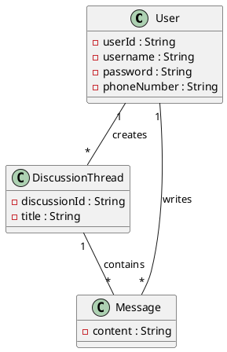

# uJay

## Introduction

uJay est un réseau social destiné aux étudiants de l'Université d'Ottawa.
L'application permet aux étudiants de communiquer à travers des fils de
discussion, de publier des messages, de réagir aux messages et d'envoyer
des notifications.

L'application comprend une application mobile Android connectée à un
serveur.

## Fonctionnalités

- Inscription des utilisateurs au service
- Authentification des utilisateurs
- Création de fils de discussion
- Consultation des fils de discussion
- Ajout de messages dans un fil de discussion
- Consultation des messages
- Réaction aux messages
- Envoi de notifications SMS
- Gestion des utilisateurs
- Modération des messages et des fils de discussion

## Diagramme de classes

## Informations

| Nom | Numéro d'étudiant | Rôle |
|---|---|---|
| Damien Lan | 300482848 | [Ton rôle] |
| Yulia Polman | [Numéro] | [Rôle] |
| Ica Ishimwe | 300417408 | [Rôle] |
| Steve Watcho Meupep | 300509319 | [Rôle] |
